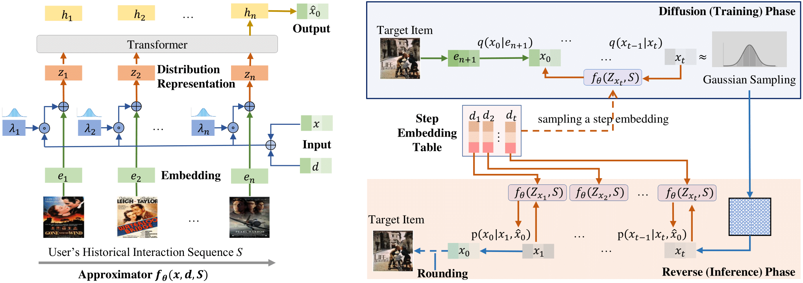

# DiffuRec4POI
用于下一个POI推荐的扩散模型，增加时间与空间感知


## Usage

0. Clone this repo

    ```
    git clone https://github.com/wangsh363/DiffuRec4POI.git
    ```

1. Create environment & Install requirements

    ```
    conda new -n DiffuRec4POI python=3.9
    ```

    ```
    pip3 install torch torchvision torchaudio --index-url https://download.pytorch.org/whl/cu118
    ```

2. You can run the below command for model training and evaluation.
    ```
    python main.py --dataset gowalla
    ```

文档持续更新……
